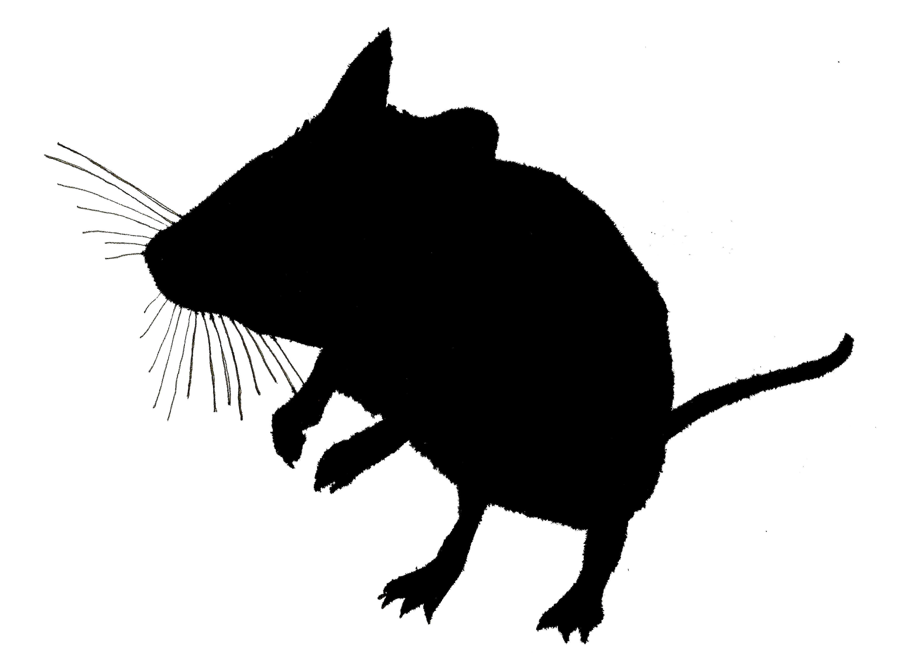

# Supporting [automated forecasting](https://github.com/weecology/portal-forecasts) of [rodent populations](https://portal.weecology.org/)

   

[](https://github.com/weecology/portalcasting/actions/workflows/r-cmd-check.yaml)
[](https://github.com/weecology/portalcasting/actions/workflows/docker-publish.yml)
[](https://app.codecov.io/github/weecology/portalcasting/branch/main)
[](https://lifecycle.r-lib.org/articles/stages.html)
[](https://www.repostatus.org/#active)
[](https://raw.githubusercontent.com/weecology/portal-forecasts/master/LICENSE)
[](https://doi.org/10.5281/zenodo.3332973)
[](https://www.nsf.gov/awardsearch/showAward?AWD_ID=1929730)
[](https://doi.org/10.21105/joss.03220)


## Overview

The `portalcasting` package offers a comprehensive system for developing, deploying, and evaluating ecological models that forecast changes in ecological systems over time. It particularly focuses on the long-term study of mammal population and community dynamics, known as the [Portal Project](https://portal.weecology.org/).

### Core Depedencies

The `portalcasting` package depends on the **PortalData**  and  **portalr** packages.

-  [PortalData](https://github.com/weecology/PortalData) is the collection of all the Portal project data.
-  [portalr](https://github.com/weecology/portalr) is a collection of functions to summarize the Portal data.

The `portalcasting` package integrates the [PortalData repository](https://github.com/weecology/PortalData) and the [portalr data management package](https://github.com/weecology/portalr) into a streamlined pipeline. This pipeline is used to forecast.

The functionality of `portalcasting` extends beyond its deployment, as its functions are portable. This allows users to establish a fully-functional replica repository on either a local or remote machine, facilitating the development and testing of new models within a [sandbox](https://en.wikipedia.org/wiki/Sandbox_software_development) environment.

## Current deployment:

The [Portal-forecasts](https://github.com/weecology/portal-forecasts) houses tools that leverage the portalcasting pipeline to generate weekly forecasts.
The forecasts are then showcased on the [Portal Forecasts website](https://portal.naturecast.org).
This website offers users an interactive interface to explore the forecasting results.
The source code for this website is [hosted on GitHub](https://github.com/weecology/portal-forecast-web).
Additionally, the portal-forecasts repository archives the forecasts on both GitHub and Zenodo

## Docker Container

We leverage a [Docker container](https://hub.docker.com/r/weecology/portalcasting) to enable reproducibility of the [Portal forecasting](https://github.com/weecology/portal-forecasts).
Presently, we use a [Docker](https://hub.docker.com/r/weecology/portalcasting) image of the software environment to create a container for running the code.
The image is automatically rebuilt when there is a new `portalcasting` release, tagged with both the `latest` and version-specific (`vX.X.X`) tags, and pushed to [DockerHub](https://hub.docker.com/r/weecology/portalcasting).

Because the `latest` image is updated with releases, the current main branch code in `portalcasting` is typically, but not necessarily always, being executed within the [predictions repository](https://github.com/weecology/portalPredictions).

The API is actively developed and welcomes any contributors.

## Installation

You can install the package from github:

```r
install.packages("remotes")
remotes::install_github("weecology/portalcasting")
```

You will need to install `rjags` and JAGS.

MacOS users are recommended to install rjags after reading the instructions on the package's README file, or use the JAGS discussion forum thread for help under the [MacOS installation of JAGS](https://sourceforge.net/p/mcmc-jags/discussion/search/?q=MacOS+installation&project=0).


```r
install.packages("rjags", configure.args="--enable-rpath")
```

## Production environment

If you wish to spin up a local container from the `latest` `portalcasting` image (to ensure that you are using a copy of the current production environment for implementation of the `portalcasting` pipeline), you can run

```
sudo docker pull weecology/portalcasting
```
from a shell on a computer with [Docker](https://www.docker.com/) installed.


## Usage

Get started with the ["how to set up a Portal Predictions directory" vignette](https://weecology.github.io/portalcasting/articles/getting_started.html).

If you are interested in adding a model to the preloaded [set of models](https://weecology.github.io/portalcasting/articles/current_models.html), see the ["adding a model and data" vignette](https://weecology.github.io/portalcasting/articles/adding_model_and_data.html). That document also details how to expand the datasets available to new and existing models.


## Developer and Contributor notes

We welcome any contributions in form of models or pipeline changes.

For the workflow, please checkout the [contribution](.github/CONTRIBUTING.md) and [code of conduct](.github/CODE_OF_CONDUCT.md) pages. 


## Acknowledgements

This project is developed in active collaboration with [DAPPER Stats](https://www.dapperstats.com/).

The motivating study—the Portal Project—has been funded nearly continuously since 1977 by the [National Science Foundation](https://www.nsf.gov/), most recently by [DEB-1622425](https://www.nsf.gov/awardsearch/showAward?AWD_ID=1622425) to S. K. M. Ernest.
Much of the computational work was supported by the [Gordon and Betty Moore Foundation’s Data-Driven Discovery Initiative](https://www.moore.org/initiative-strategy-detail?initiativeId=data-driven-discovery) through [Grant GBMF4563](https://www.moore.org/grant-detail?grantId=GBMF4563) to E. P. White.

We thank Heather Bradley for logistical support, John Abatzoglou for assistance with climate forecasts, and James Brown for establishing the Portal Project.

