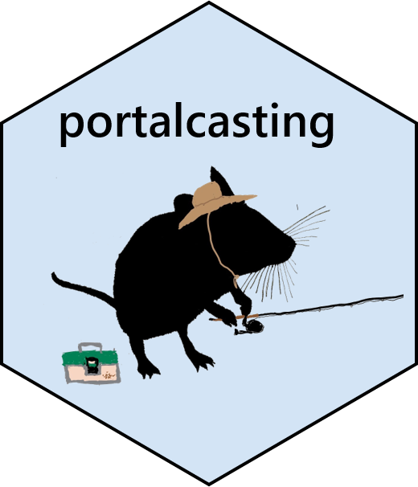

# Supporting [automated forecasting](https://github.com/weecology/portalPredictions) of [rodent populations](https://portal.weecology.org/)

   

[](https://github.com/weecology/portalcasting/actions/workflows/check-release.yaml)
[](https://github.com/weecology/portalcasting/actions/workflows/docker-publish.yml)
[](https://codecov.io/github/weecology/portalcasting/branch/main)
[](https://lifecycle.r-lib.org/articles/stages.html)
[](https://www.repostatus.org/#active)
[](https://raw.githubusercontent.com/weecology/portalPredictions/master/LICENSE)
[](https://doi.org/10.5281/zenodo.3332973)
[](https://www.nsf.gov/awardsearch/showAward?AWD_ID=1929730)
[](https://doi.org/10.21105/joss.03220)


## Overview

The `portalcasting` package provides a model development, deployment, and evaluation system for forecasting how ecological systems change through time, with a focus on a widely used long-term study of mammal population and community dynamics, the [Portal Project](https://portal.weecology.org/).
It combines the [Portal  Data Repository](https://github.com/weecology/PortalData) and [portalr data management package](https://github.com/weecology/portalr) in a pipeline to automate weekly forecasting.
Forecasts are archived on [GitHub](https://github.com/weecology/portalPredictions) and [Zenodo](https://doi.org/10.5281/zenodo.833438).
The [Portal Forecasting website](https://portal.naturecast.org/) provides a dynamic view of the results.

`portalcasting`'s functions are also portable, allowing users to set up a fully-functional replica repository on a local or remote machine.
This facilitates development and testing of new models
via a [sandbox](https://en.wikipedia.org/wiki/Sandbox_(software_development)) approach. 

## Status: Deployed, Active Development

The `portalcasting` package is deployed for use within the [Portal Predictions repository](https://github.com/weecology/portalPredictions), providing the underlying R code to populate the directory with up-to-date data, analyze the data, produce new forecasts, generate new output figures, and render a new version of the [website](https://portal.naturecast.org/). 
All of the code underlying the forecasting functionality has been migrated over from the [predictions repository](https://github.com/weecology/portalPredictions), which contains the code executed by the continuous integration. 
Having relocated the code here, the `portalcasting` package is the location for active development of the model set and additional functionality. 

We leverage a [software container](https://en.wikipedia.org/wiki/Operating-system-level_virtualization) to enable reproducibility of the [predictions repository](https://github.com/weecology/portalPredictions). 
Presently, we use a [Docker](https://hub.docker.com/r/weecology/portalcasting) image of the software environment to create a container for running the code. 
The image is automatically rebuilt when there is a new `portalcasting` release, tagged with both the `latest` and version-specific (`vX.X.X`) tags, and pushed to [DockerHub](https://hub.docker.com/r/weecology/portalcasting). 

Because the `latest` image is updated with releases, the current master branch code in `portalcasting` is not necessarily always being executed within the [predictions repository](https://github.com/weecology/portalPredictions). 
A development image (`dev`) is built from the master branch of `portalcasting` at every push to facilitate testing and should not be considered stable.

The API is moderately well defined at this point, but is still evolving.

## Installation

You can install the package from github:

```r
install.packages("remotes")
remotes::install_github("weecology/portalcasting")
```

## Production environment

If you wish to spin up a local container from the `latest` `portalcasting` image (to ensure that you are using a copy of the current production environment for implementation of the `portalcasting` pipeline), you can run

```
sudo docker pull weecology/portalcasting
```
from a shell on a computer with [Docker](https://www.docker.com/) installed. 


## Usage

Get started with the ["how to set up a Portal Predictions directory" vignette](https://weecology.github.io/portalcasting/articles/getting_started.html).

If you are interested in adding a model to the preloaded [set of models](https://weecology.github.io/portalcasting/articles/current_models.html), see the ["adding a model" vignette](https://weecology.github.io/portalcasting/articles/adding_model_and_data.html). 


## Developer and Contributor notes

We welcome any contributions in form of models or pipeline changes.  

For the workflow, please checkout the [contribution](CONTRIBUTING.md) and [code of conduct](CODE_OF_CONDUCT.md) pages. 


## Acknowledgements

This project is developed in active collaboration with [DAPPER Stats](https://www.dapperstats.com/).

The motivating study—the Portal Project—has been funded nearly continuously since 1977 by the [National Science Foundation](https://www.nsf.gov/), most recently by [DEB-1622425](https://www.nsf.gov/awardsearch/showAward?AWD_ID=1622425) to S. K. M. Ernest. 
Much of the computational work was supported by the [Gordon and Betty Moore Foundation’s Data-Driven Discovery Initiative](https://www.moore.org/initiative-strategy-detail?initiativeId=data-driven-discovery) through [Grant GBMF4563](https://www.moore.org/grant-detail?grantId=GBMF4563) to E. P. White. 

We thank Heather Bradley for logistical support, John Abatzoglou for assistance with climate forecasts, and James Brown for establishing the Portal Project. 


