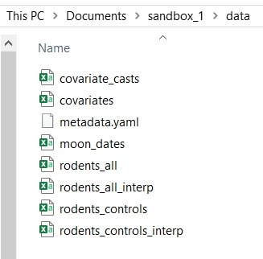
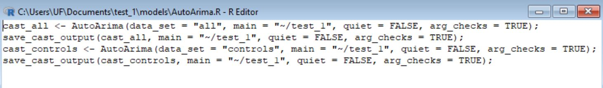
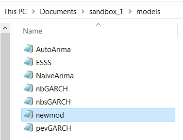
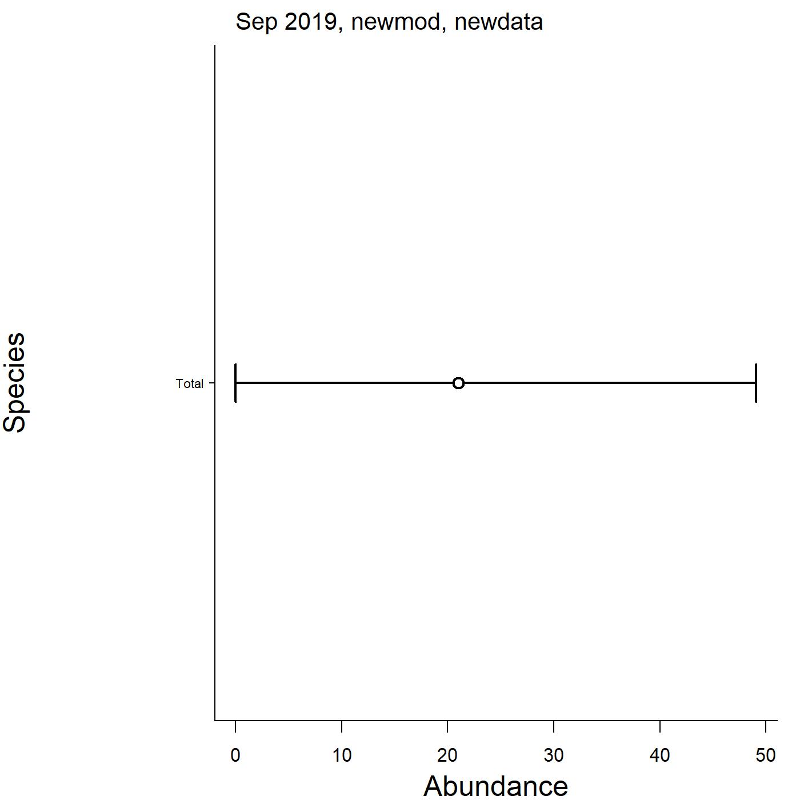

```{r setup, include=FALSE}
knitr::opts_chunk$set(
  collapse = TRUE,
  comment = "#>"
)
```

## Overview

The **portalcasting** package provides the ability to add functions both to a local copy of the repository for testing as well as to contribute to the base set of models provided within the package (and thus executed in the
main repository). Similarly, users may often want or need to analyze the data in a slightly different configuration than what is already available. Here, we walk through the steps to add user-defined models and data sets to the directory for local use or for integration within the production pipeline.

For the purposes here, consider that you are interested in adding a model named "newmod" to the forecasting suite. While "newmod" can work on the existing data, you are are really interested in a slightly different configuration (perhaps only the long-term kangaroo rat exclosures) of the data you call "newdata".  

Here, we assume the user has already run through a basic installation, set up, and evaluation of the package, as covered in the [Getting Started](https://weecology.github.io/portalcasting/articles/howto.html) vignette.

## Model requirements

Unlike previous versions of **portalcasting**, starting with v0.9.0, there are very few formal requirements for the output of a model. Indeed, a model does not inherently need to produce any particular output to be valid and run. Rather, if the user desires the output to be archived with the other cast output, they must run the function `save_cast_output()` in their script, which requires that the `cast` argument be a list. If the list contains elements named `metadata`, `cast_tab`, `model_fits`, or `model_casts`, they are saved out (see `save_cast_output()`).

## Set up the directory

To allow for a more flexible environment, here we use the `setup_sandbox()` function to make and fill our directory, which we house at `"~/sandbox_1"`:

```{r, eval=FALSE}
library(portalcasting)
main <- "~/sandbox_1"
setup_sandbox(main = main)
```

{width=400px} 


The standard, prefabricated ("prefab") models that come with the **portalcasting** package are automatically added to the directory's `models` sub folder. 


{width=400px} 

Similarly, the standard, prefabricated ("prefab") data sets that come with the **portalcasting** package are automatically added to the directory's `data` sub folder. 


{width=400px} 


The default model scripts take advantage of having main functions that contain the majority of the code, such as `AutoArima()`, which returns a `list` with output components that are passed into `save_cast_output`, which adds the results from the model run to the `casts` sub folder. 


{width=600px} 


You do not need to use a model function like `AutoArima()` in your script, however. The pipeline will work with basically any code that will run in R. The whole script is run using `source()` and it is wrapped (within `cast()`) in a `tryCatch()` call, which softens any errors at the whole-script level.

You may be interested in one or both of two levels of model/data-adding. At one level, you might be interested in just working "locally" (although maybe on a remote machine or server, just not *the* server that runs the production pipeline), perhaps to do some basic exploration, actively engage in research and development, or spin off another project using the same infrastructure. For the present vignette, we'll call that the "development space". At another level, you might be interested in adding to the stuff that's run as part of the existing main project's production pipeline (). Here, we'll call that the "production space". It's likely that you might use the "development space" on the way to the "production space" or that the "development space" is sufficient in and of itself for your needs. We'll detail adding models and data in each of these spaces in the subsequent sections.

## Adding in a development space

### Adding a model

The **portalcasting** machinery allows any model with a script in the `models` sub-directory to be run just like the prefab model scripts. All that is required is for the user to save the script with the name and name the model explicitly in the `models` argument for `portalcast()`.

{width=400px} 

Obviously, you'll need to add some code to the `newmod.R` script, but as stated above, the requirements are lax and the options broad.

If you would like your output to be archived with the other cast output, your code must produce a `list` object and you must pass it to `save_cast_output()` in your script. If the list contains elements named `metadata`, `cast_tab`, `model_fits`, or `model_casts`, they are saved out. See `save_cast_output()` for processing specs and the models in `prefab_model_functions` for execution.

As an example here, I have filled out the model script for newmod with a very basic model. It uses a linear regression with no autocorrelation and only analyzes the total rodent counts. The forecast is simply the linear model's prediction over the future moons. 

{width=400px} 

As you can see, the model metadata contains a lot of key information used to fit the models, such as the forecast horizon (which for Portal may not necessarily be equal to the theoretical lead time, as some surveys are missed and there is a lag to entering data, so sometimes additional surveys need to be cast)

### Adding a data set

To add "newdata" to the available data set, it is important to recognize that the rodent preparation functions point directly to the [**portalr** `summarize_rodent_data` function](https://weecology.github.io/portalr/reference/summarize_rodent_data.html), which allows for flexible data customization. 

**portalcasting** turns the arguments in `summarize_rodent_data` into arguments in `rodent_control()`, which sets default values for most arguments, but does require an input for `name`, which names the data set, otherwise it will return `NULL`. Here, we create the data control list and call it `ndc`, allowing us to model the rodents found on the removal plots only. We can then create the data set to verify it looks like how we want by running the `prep_rodents()` function, which returns the data set to the console and saves it in the `data` sub-directory (Note that we **must** set `arg_checks = FALSE` to allow for the creation and use of the non-standard rodents data configuration.)

```{r, eval=FALSE}
newdata_controls <- rodents_control(name = "newdata", level = "Treatment", treatment = "removal", arg_checks = FALSE)

newdat <- prep_rodents(main = main, data_sets = "newdata", controls_rodents = newdata_controls, arg_checks = FALSE)
```

{width=400px} 

Although `prep_rodents()` returns the data to the console, you might want to retrieve it later again (perhaps in a new R instance), for which `read_rodents()` is flexible enough:


```{r, eval=FALSE}
newdat <- read_rodents(main = main, data_set = "newdata")
```

### Running the model with the data

To run the model with the pipeline, you then simply use `portalcast` with a few additional arguments to specify the model and data components. However, you will notice that there is no `data_sets` argument in `portalcast`... so how do you tell the function what data sets the models will need? Well, the function automatically grabs the data sets that are required by the models named in the `models` argument, so how do you tell the function what newmod needs? You do that by creating a model control list:

```{r, eval=FALSE}
newmod_controls <-  model_control(name = "newmod", data_sets = "newdata")
```

And then you can run the `portalcast` function with the arguments specified as needed:

```{r, eval=FALSE}
portalcast(main = main, models = "newmod", controls_model = newmod_controls, controls_rodents = newdata_controls, arg_checks = FALSE)
```

To visualize the output, simply run `plot_cast_ts` and `plot_cast_point`:

```{r, eval=FALSE}
plot_cast_ts(main = main)
```

{width=600px} 


```{r, eval=FALSE}
plot_cast_point(main = main)
```

{width=600px} 

Reading the cast's predictions into the R console is done using `read_cast_tab`, which also defaults to the most recently generated output:

```{r, eval=FALSE}
read_cast_tab(main = main)
```

To choose a non-default output, use `select_casts` to read in the cast metadata with any desired filters on `end_moon`, `model`, or `data_set` and then locate the `cast_id` of interest:

```{r, eval=FALSE}
select_casts(main = main)
```


### Checklist

1. Create script for "newmod" (`~/sandbox_1/main/newmod.R`).
2. Fill script with model code.
    + Create a model control list called `controls_newmod` using `model_control`
3. Add "newdata"
    + Create a data control list called `controls_newdata` using `rodents_control`
4. Run model script using `portalcast`
    + Include `models = "newmod"` to tell the function to use the new model
    + Include `controls_models = controls_newmod` to tell the function what the model needs
    + Include `controls_rodents = controls_newdata` to tell the function how to configure the new data set
    + Include `arg_checks = FALSE` to allow the function to use non-standard inputs

## Adding in a production space

Once you've worked out all of the kinks in your model and are interested in adding it to the prefabricated (prefab)

### Adding a model

 (Moving your model to the production pipeline will, however, require encapsulating that code within a function, which we will address later in this vignette)

to add a model permanently to prefab

add the controls to the \code{prefab_model_controls} non-exported function
in the \code{prepare_models.R} script
will automatically add the model to the prefab_models 

### Adding a data set

sames for data sets


