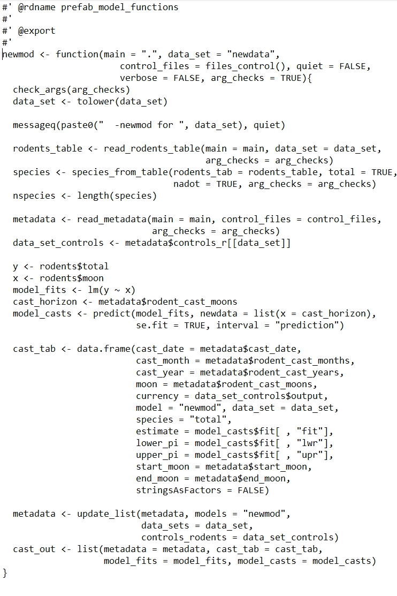
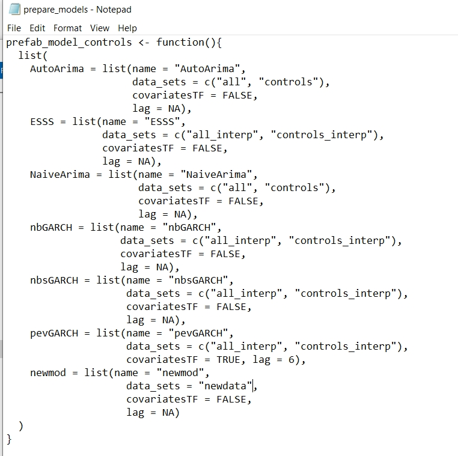
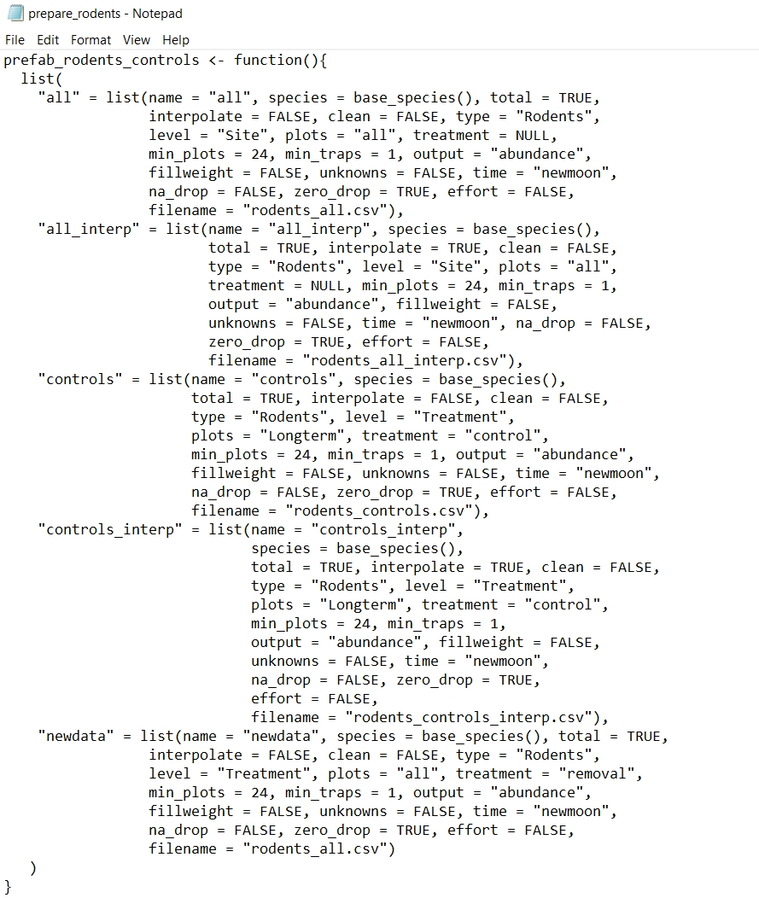
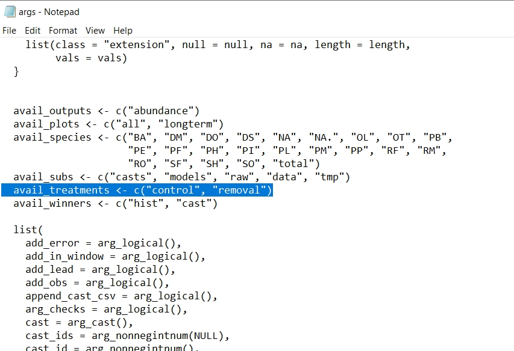
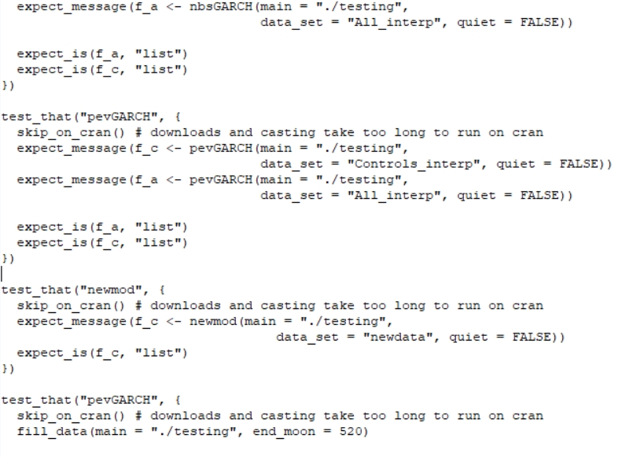

```{r setup, include=FALSE}
knitr::opts_chunk$set(
  collapse = TRUE,
  comment = "#>"
)
```

## Overview

The **portalcasting** package provides the ability to add functions both to a local copy of the repository for testing as well as to contribute to the base set of models provided within the package (and thus executed in the
main repository). Similarly, users may often want or need to analyze the data in a slightly different configuration than what is already available. Here, we walk through the steps to add user-defined models and data sets to the directory for local use or for integration within the production pipeline.

For the purposes here, consider that you are interested in adding a model named "newmod" to the forecasting suite. While "newmod" can work on the existing data, you are are really interested in a slightly different configuration (perhaps only the long-term kangaroo rat exclosures) of the data you call "newdata".  

Here, we assume the user has already run through a basic installation, set up, and evaluation of the package, as covered in the [Getting Started](https://weecology.github.io/portalcasting/articles/getting_started.html) vignette.

## Model requirements

Unlike previous versions of **portalcasting**, starting with v0.9.0, there are very few formal requirements for the output of a model. Indeed, a model does not inherently need to produce any particular output to be valid and run. Rather, if the user desires the output to be archived with the other cast output, they must run the function `save_cast_output()` in their script, which requires that the `cast` argument be a list. If the list contains elements named `metadata`, `cast_tab`, `model_fits`, or `model_casts`, they are saved out (see `save_cast_output()`).


## Set up the directory

To allow for a more flexible environment, here we use the `setup_sandbox()` function to make and fill our directory, which we house at `"~/sandbox_1"`:

```{r, eval=FALSE}
library(portalcasting)
main <- "~/sandbox_1"
setup_sandbox(main = main)
```

{width=400px} 


The standard, prefabricated ("prefab") models that come with the **portalcasting** package are automatically added to the directory's `models` sub folder. 


{width=400px} 

Similarly, the standard, prefabricated ("prefab") data sets that come with the **portalcasting** package are automatically added to the directory's `data` sub folder. 


{width=400px} 


The default model scripts take advantage of having main functions that contain the majority of the code, such as `AutoArima()`, which returns a `list` with output components that are passed into `save_cast_output`, which adds the results from the model run to the `casts` sub folder. 


{width=600px} 


You do not need to use a model function like `AutoArima()` in your script, however. The pipeline will work with basically any code that will run in R. The whole script is run using `source()` and it is wrapped (within `cast()`) in a `tryCatch()` call, which softens any errors at the whole-script level.

You may be interested in one or both of two levels of model/data-adding. At one level, you might be interested in just working "locally" (although maybe on a remote machine or server, just not *the* server that runs the production pipeline), perhaps to do some basic exploration, actively engage in research and development, or spin off another project using the same infrastructure. For the present vignette, we'll call that the "development space". At another level, you might be interested in adding to the stuff that's run as part of the existing main project's production pipeline (). Here, we'll call that the "production space". It's likely that you might use the "development space" on the way to the "production space" or that the "development space" is sufficient in and of itself for your needs. We'll detail adding models and data in each of these spaces in the subsequent sections.

## Adding in a development space

### Adding a model

The **portalcasting** machinery allows any model with a script in the `models` sub-directory to be run just like the prefab model scripts. All that is required is for the user to save the script with the name and name the model explicitly in the `models` argument for `portalcast()`.

{width=400px} 

Obviously, you'll need to add some code to the `newmod.R` script, but as stated above, the requirements are lax and the options broad.

If you would like your output to be archived with the other cast output, your code must produce a `list` object and you must pass it to `save_cast_output()` in your script. If the list contains elements named `metadata`, `cast_tab`, `model_fits`, or `model_casts`, they are saved out. See `save_cast_output()` for processing specs and the models in `prefab_model_functions` for execution.

As an example here, I have filled out the model script for newmod with a very basic model. It uses a linear regression with no autocorrelation and only analyzes the total rodent counts. The forecast is simply the linear model's prediction over the future moons. 

{width=600px} 

As you can see, the model metadata contains a lot of key information used to fit the models, such as the forecast horizon (which for Portal may not necessarily be equal to the theoretical lead time, as some surveys are missed and there is a lag to entering data, so sometimes additional surveys need to be cast)

### Adding a data set

To add "newdata" to the available data sets, it is important to recognize that the rodent preparation functions point directly to the [**portalr** `summarize_rodent_data` function](https://weecology.github.io/portalr/reference/summarize_rodent_data.html), which allows for flexible data customization. 

**portalcasting** turns the arguments in `summarize_rodent_data` into arguments in `rodents_control()`, which sets default values for most arguments, but does require an input for `name`, which names the data set, otherwise it will return `NULL`. Here, we create the data control list and call it `newdata_controls`, allowing us to model the rodents found on the removal plots only. We can then create the data set to verify it looks like how we want by running the `prep_rodents()` function, which returns the data set to the console and saves it in the `data` sub-directory (Note that we **must** set `arg_checks = FALSE` to allow for the creation and use of the non-standard rodents data configuration.)

```{r, eval=FALSE}
newdata_controls <- rodents_control(name = "newdata", level = "Treatment", treatment = "removal", arg_checks = FALSE)

newdata <- prep_rodents(main = main, data_sets = "newdata", controls_rodents = newdata_controls, arg_checks = FALSE)
```

{width=400px} 

Although `prep_rodents()` returns the data to the console, you might want to retrieve it later again (perhaps in a new R instance), for which `read_rodents()` is flexible enough:


```{r, eval=FALSE}
newdat <- read_rodents(main = main, data_set = "newdata")
```

### Running the model with the data

To run the model with the pipeline, you then simply use `portalcast` with a few additional arguments to specify the model and data components. However, you will notice that there is no `data_sets` argument in `portalcast`... so how do you tell the function what data sets the models will need? Well, the function automatically grabs the data sets that are required by the models named in the `models` argument, so how do you tell the function what newmod needs? You do that by creating a model control list:

```{r, eval=FALSE}
newmod_controls <-  model_control(name = "newmod", data_sets = "newdata")
```

And then you can run the `portalcast` function with the arguments specified as needed:

```{r, eval=FALSE}
portalcast(main = main, models = "newmod", controls_model = newmod_controls, controls_rodents = newdata_controls, arg_checks = FALSE)
```

To visualize the output, simply run `plot_cast_ts` and `plot_cast_point`:

```{r, eval=FALSE}
plot_cast_ts(main = main)
```

{width=600px} 


```{r, eval=FALSE}
plot_cast_point(main = main)
```

{width=600px} 

Reading the cast's predictions into the R console is done using `read_cast_tab`, which also defaults to the most recently generated output:

```{r, eval=FALSE}
read_cast_tab(main = main)
```

To choose a non-default output, use `select_casts` to read in the cast metadata with any desired filters on `end_moon`, `model`, or `data_set` and then locate the `cast_id` of interest:

```{r, eval=FALSE}
select_casts(main = main)
```


### Checklist

1. Create script for "newmod" at `~/sandbox_1/main/newmod.R`
    + Fill script with model code
2. Create a model control list called `newmod_controls` using `model_control`
3. Add "newdata"
    + Create a data control list called `newdata_controls` using `rodents_control`
4. Run model script using `portalcast`
    + Include `models = "newmod"` to tell the function to use the new model
    + Include `controls_model = newmod_controls` to tell the function what the model needs
    + Include `controls_rodents = newdata_controls` to tell the function how to configure the new data set
    + Include `arg_checks = FALSE` to allow the function to use non-standard inputs

## Adding in a production space

Once you've worked out all of the kinks in your model and are interested in adding it to the prefabricated (prefab) set, some additional steps will be required. 

First create a branch from the master branch on the **portalcasting** [GitHub repo](https://github.com/weecology/portalcasting). This allows you to work within the package environment. 

### Adding a model

Moving your model to the production pipeline requires encapsulating that code within a function (with the same name as the model, so here `newmod()`), similar to how the other prefab models are (for example `AutoArima()`). Notably, each function works on a single data set (for example "all" or "controls") at a time. Models that work on multiple data sets (such as `AutoArima()` on both "all" and "controls") have that indicated in their control lists.

The prefab model functions have a shared set of arguments and documentation, highlighting their similarity in structure.

Each function takes the following arguments:
  * `main` (points to the directory)
  * `data_set` (indicates which version of the data a particular run of the model will cover)
  * `control_files` (is a control list with file names)
  * `quiet` and `verbose` (deal with message printing)
  * `arg_checks` (handles argument checking)
and if the model uses covariates, it will also take:
  * `lag` (indicates the number of steps for lagging the covariates)

Each function also returns a list with elements named `metadata`, `cast_tab`, `model_fits`, and `model_casts`, as was discussed earlier. This is more important here, as each prefab model has its output automatically saved using `save_cast_output()`.

Based off of the other prefab models, here is an example of how to encapsulate `newmod()`:

{width=400px} 

Once you have the model encapsulated in a function, add that function to the `prefab_model_functions` object within `prefab_models.R` script and add the relevant text to the documentation.

You then need to permanently add the controls for the model (the control list called `newmod_controls`) into the (non-exported) function `prefab_model_controls`, which is at the top of the `prepare_models.R` script. This function houses the controls for models that are loaded by default and is also used to extract the names of the models. 

{width=400px} 


### Adding a data set

Similarly to with adding the model, you then need to permanently add the controls for the data (the control list called `newdata_controls`) into the (non-exported) function `prefab_rodents_controls`, which is at the top of the `prepare_rodents.R` script. This function houses the controls for data sets that are loaded by default and is also used to extract the names of the data sets. 

{width=400px} 

Notably here, as mentioned earlier, the input for `treatment` (`"removal"`) was not previously allowed (so you needed to set `arg_checks = FALSE`). To permanently allow it, you'll need to add it to the available treatment options within the `check_arg_list()` function in the `args.R` script. This is true of any level that needs to be added to the available options.

{width=400px} 


### Running the model with the data set

Running the model is now then nearly as easy as using `portalcast()` with base arguments. First make sure you can build the package:

```{r, eval=FALSE}
devtools::load_all()
```

Then, verify that the proper version of the model scripts are in the `models` subdirectory:

```{r, eval=FALSE}
fill_models(main = main)
```

This will create the `newmod.R` script akin to the other prefab models. 

And either run newmod by itself

```{r, eval=FALSE}
portalcast(main = main, models = "newmod")
```

or with all of the other models

```{r, eval=FALSE}
portalcast(main = main)
```

Model output can then be read in, visualized, and processed as before with the hand-done script.

### Verification

Having added your code to the package, it is imperative that you add unit tests for the model to the tests in the package already (within the package, in the `tests/testthat/test-15-prefab_models.R` script). Tests should be added for each of the data sets used. 

{width=400px} 

Note that because of the length of time taken downloading data and running models, the majority of tests are not implemented on CRAN, which should be followed here, as none of the necessary components will be available for use. Because newmod only applies to the total rodent counts, there was no need to thin the data set, but models that apply across all of the species and the total can take a long time to run. Presently, we therefore thin the controls, all, controls_interp, and all_interp data sets for use. It is highly recommended that you do this for additional data sets you add, and the code implemented within that testing script provides working examples. 

With the tests added, you should then verify that the package will still pass through the following set of calls to package-building functions in **devtools**:

```{r, eval=FALSE}
devtools::document()
devtools::check()
devtools::test()
```

Once you are all ready to go, submit the code on your branch as a [pull request](https://github.com/weecology/portalcasting/pulls) and tag @juniperlsimonis.

### Checklist

1. Create a branch from the master on the [GitHub repo](https://github.com/weecology/portalcasting)
2. Turn the script for "newmod" into a function called `newmod`
3. Add that function to the `prefab_model_functions` object in the `prefab_models.R` script 
    + Be sure to include the model in the documentation
4. Put the `newmod_controls` list into the `prefab_model_controls` in the `prepare_models.R` script
5. Put the `newdata_controls` list into the `prefab_rodents_controls` in the `prepare_rodents.R` script
6. Add tests
7. Run tests and checks    
8. Submit the code as a pull request on GitHub

## Applying existing models to new data sets

This vignette focused on adding models and data in combination, but users may also be interested in just adding data sets to existing models. To accomplish this, a user should follow a restricted version of the tasks covered above. 

Specifically, the user does not need to create a new model script or function and its associated control list, but rather just update the existing control list for the model of interest to include the new data sets.

One noteworthy argument is `update_prefab_models` which is by default `FALSE`, but the user will need to switch to `TRUE` for this.

### Checklist for sandboxing a new data set with an existing model (e.g., adding interpolated exclosure data to ESSS)

1. Create a model control list called `ESSS_controls` using `model_control`
2. Add "interpolated exclosure data"
    + Create a data control list called `exclosure_interp_controls` using `rodents_control`
3. Run model script using `portalcast`
    + Set `update_prefab_models = TRUE`
    + Include `models = "ESSS"` to tell the function to use the new model
    + Include `controls_model = ESSS_controls` to tell the function what the model needs
    + Include `controls_rodents = exclosure_interp_controls` to tell the function how to configure the new data set
    + Include `arg_checks = FALSE` to allow the function to use non-standard inputs

```{r, eval=FALSE}
main <- "~/portalcasting_testing"
setup_dir(main = main)
ESSS_controls <- prefab_model_controls()$ESSS
ESSS_controls$data_sets <- c(ESSS_controls$data_sets, "exclosure_interp")
exclosure_interp_controls <- rodents_control(name = "exclosure_interp", 
                                             interpolate = TRUE,
                                             level = "Treatment", 
                                             treatment = "exclosure",
                                             arg_checks = FALSE)
portalcast(main = main, models = "ESSS", controls_model = ESSS_controls, 
           update_prefab_models = TRUE,  
           controls_rodents = exclosure_interp_controls, arg_checks = FALSE)
```

### Checklist for adding a new data set for an existing model (e.g., adding interpolated exclosure data to ESSS) in the production pipeline

1. Create a branch from the master on the [GitHub repo](https://github.com/weecology/portalcasting)
2. Put the new version of the `ESSS_controls` list into the `prefab_model_controls` in the `prepare_models.R` script
5. Put the `exclosure_interp_controls` list into the `prefab_rodents_controls` in the `prepare_rodents.R` script
6. Add tests
7. Run tests and checks    
8. Submit the code as a pull request on GitHub
