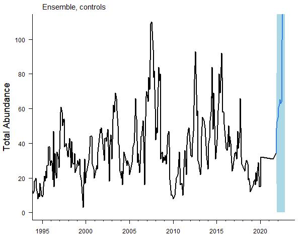
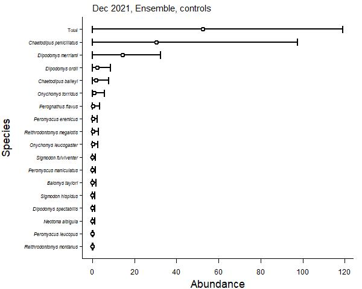
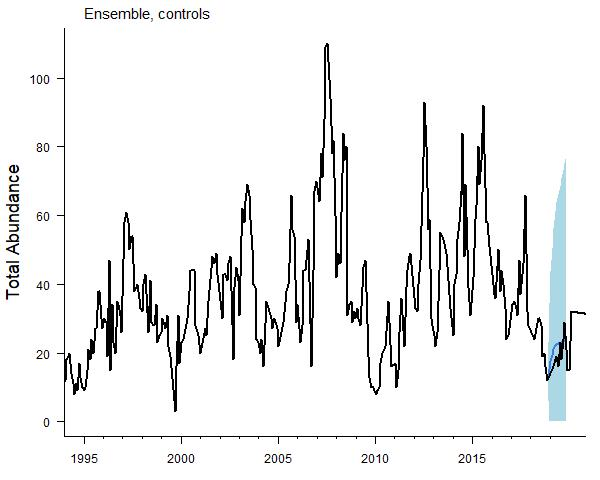

```{r setup, include=FALSE}
knitr::opts_chunk$set(
  collapse = TRUE,
  comment = "#>"
)
```

```{r, include=FALSE}
library(portalcasting)
vers <- packageVersion("portalcasting")
today <- Sys.Date()
```

This vignette shows how to set up and run your own [Portal 
Predictions](https://github.com/weecology/portalPredictions) directory.

## Installation

First things first, make sure you have the current version of **portalcasting** installed from GitHub:

```r
install.packages("devtools")
devtools::install_github("weecology/portalcasting")
library(portalcasting)
```

## Create a Portal Predictions directory

The `setup_dir()` function creates and populates a standard Portal Predictions directory that includes `tmp`, `raw`, `data`, `models`, and `casts` subdirectories. By default, `setup_dir()` downloads the most up-to-date version of the [Portal Data](https://doi.org/10.5281/zenodo.1215988) and [Portal Predictions](https://doi.org/10.5281/zenodo.833438) archives from Zenodo into the `raw` subdirectory, prepares the moons, rodents, covariates, covariate forecast, and metadata data files (and places them in the `data` subdirectory) and populates the `models` subdirectory with scripts for the six existing models ("AutoArima", "NaiveArima", "ESSS", "nbGARCH", "nbsGARCH", and "pevGARCH").

Specialized versions of `setup_dir` are tailored for local model exploration, development, and  testing ("`setup_sandbox`") and for use in the real-deal pipeline ("`setup_production`"). The settings are fairly similar, although `setup_sandbox` has extra rigid argument checking turned off and extra verbose messaging turned on. `setup_dir` provides a good starting point for a user interested in seeing what the package can do, with specific error checking and tidy messaging, so we use it here.

There are many arguments available for the user to tailor the setup of the directory, which can be found on the help page (`?setup_dir`). Perhaps the most important argument is `main` which allows the user to point the directory to any particular location. The default is `main = "."`, which is basically "the present directory". A common implementation would be to create a directory in the home directory of a computer (indicated by `"~"`) and within a named folder, say "portalcast_directory", which would be done with `main = "~/portalcast_directory"`, or by setting `main <- "~/portalcast_directory"` and then using `main = main` throughout the code:

```{r, eval=FALSE}
main <- "~/portalcast_directory"
setup_dir(main = main)
```

## Run a cast (forecast or hindcast)

The `portalcast()` function controls the running of potentially multiple models across different data sets for multiple time steps. They can involve what we have classically called "forecasts" (from the present time step) and "hindcast" (from a time step before the current one). It will prepare the data (rodents, covariates, newmoons, metadata) as needed, verify that the requested models are available to run, run the models, and compile the output. 

Presently, the preloaded model set includes [six models](https://weecology.github.io/portalcasting/articles/models.html): ESSS, AutoArima, NaiveArima, nbGARCH, nbsGARCH, and pevGARCH. The GARCH models all take a bit longer to run (nbGARCH less time than nbsGARCH less time than pevGARCH), so for the purposes of illustration, we will only run ESS, AutoArima, and NaiveArima models, which we indicate through input to the `models` argument: 

```{r, eval=FALSE}
portalcast(main = main, models = c("ESSS", "AutoArima", "NaiveArima"))
```

If the user does not specify the models, all of the prefab models are run. Note that we need to point `portalcast` to the directory of interest via the `main` argument. This allows us to go between different directories from the same R session with relative ease, but it does mean that `main` is a key argument in nearly all functions. 

## Plotting the results

Presently two plotting types are available for visualizing the data and model results: time series and point-in-time plots for casts. The functions for both of these figure types point directly to the cast metadata file that allows for flexible selection of which specific model, data set, and end moon (forecast origin) to use, as well as selection via specific identifiers (when multiple versions of a model are run). By default, they select the most recent cast, which will be NaiveArima on controls.

Time series plots are constructed using `plot_cast_ts`:

```{r, eval=FALSE}
plot_cast_ts(main = main)
```

{width=600px}  

Point-in-time prediction plots are constructed using `plot_cast_point`, and default to the next step ahead in time:

```{r, eval=FALSE}
plot_cast_point(main = main)
```
{width=600px} 

## Going back in time

We can step back to an earlier date by simply setting the `end_moons` or `end_moon` (depending on the function, some can take more than one value) to earlier than the present time. 


```{r, eval=FALSE}
portalcast(main = main, models = c("ESSS", "AutoArima", "NaiveArima"), end_moons = 512)
```
Because the output from this run of `portalcast` is most recent, the plot functions default to them, although it is also simple to point to them directly using the arguments available (`?plot_cast_ts` and `?plot_cast_point`). 

```{r, eval=FALSE}
plot_cast_ts(main = main)
```

{width=600px} 

```{r, eval=FALSE}
plot_cast_point(main = main, with_census = TRUE)
```
{width=600px} 


## Reading in data to the R console from the directory

A series of `read_<name>` functions are available for simple loading of the data sets into R from the directory. A generalized `read_data` function includes an  argument for which data set to load ("rodents" [and then which specific data set], "covariates", "covariate_casts", "moons", "metadata", or "cast_metadata"), and each of those data sets also has a specific function, such as `read_moons`.

```{r, eval=FALSE}
read_data(main = main, data_name = "rodents")
read_data(main = main, data_name = "rodents_table", data_set = "all")
read_data(main = main, data_name = "rodents_table", data_set = "controls")
read_data(main = main, data_name = "rodents_table", data_set = "all_interp")
read_data(main = main, data_name = "rodents_table", data_set = "controls_interp")
read_data(main = main, data_name = "covariates")
read_data(main = main, data_name = "covariate_casts")
read_data(main = main, data_name = "moons")
read_data(main = main, data_name = "metadata")
read_data(main = main, data_name = "cast_metadata")

read_rodents(main = main)
read_rodents_table(main = main)
read_covariates(main = main)
read_covariate_casts(main = main)
read_moons(main = main)
read_metadata(main = main)
read_cast_metadata(main = main)
```

## Reading in cast output to the R console from the directory

Presently, two functions are available for interfacing with saved cast output. 

`select_casts` provides a simple interface to the cast metadata file with quick filtering:

```{r, eval=FALSE}
select_casts(main = main, models = "AutoArima")
```

And `read_cast_tab` reads in the cast_tab output from a given cast, as indicated by its cast_id, which is displayed in the output from `select_casts`:

```{r, eval=FALSE}
read_cast_tab(main = main, cast_id = 1)
```
